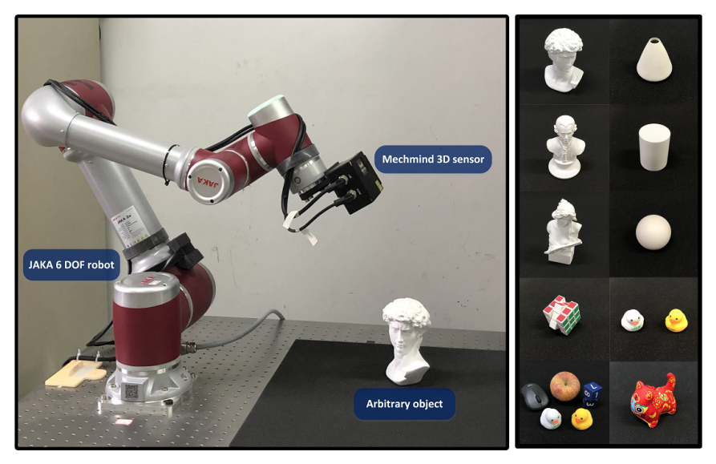
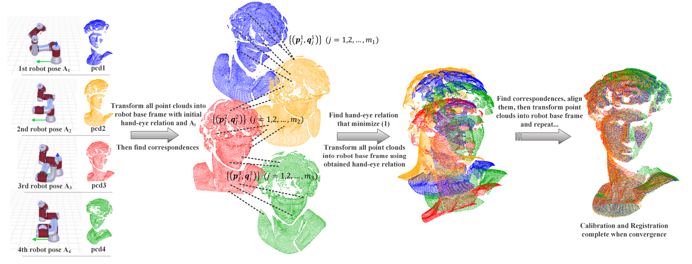

# Hand-Eye Calibration via Multi-view Point Cloud Registration for Robotics Applications

[](LICENSE)
[](https://isocpp.org/)
[](#)
[](#)

Fast and robust point cloud based hand–eye calibration (eye-on-hand and eye-to-hand) for robotics applications using Bayesian Optimization (BO-IA) and an Anderson-Accelerated ICP variant (AA-ICPv) for arbitrary objects and **N** viewpoints.
Registration-based hand-eye calibration (eye-on-hand and eye-to-hand) for 3D sensors via BO-IA + AA-ICP: Linux, N-view point cloud, automatic result saving.

---

## About

**RegHEC** is a C++17 implementation of registration-based hand–eye calibration using point cloud (e.g., time-of-flight cameras, Realsense cameras) for robotics applications that needs no checkerboards or precision targets. It jointly calibrates the camera–robot transform and aligns multi-view point clouds (N views) using Bayesian Optimization for initial alignment (BO-IA) and Anderson-Accelerated ICP (AA-ICP) for refinement. Works for eye-in-hand and eye-to-hand, handles challenging geometries (spheres, cones, cylinders, planes), and automatically saves the hand–eye matrix, merged PCD, and a screenshot. Based on the RegHEC method described in the paper; see README for details.

<p align="center">
  
  
</p>
<p align="center">
  <sub>Figure 1. Eye-in-hand experiment setup. A 6-DOF serial manipulator carrying a snapshot 3-D sensor captures point clouds of a stationery scene from different viewpoints. Objects used for experiment are shown on the right. From top to bottom, left column shows David(plaster figure), Mozart, nymph, Rubik and object cluster. Right column shows cone, cylinder, sphere, rubber ducks and tiger mascot.</sub> &nbsp;&nbsp;&nbsp;
  <sub>Figure 2. An example of proposed ICP variant in the case of point clouds captured at 4 different robot poses.</sub>
  <sub>Figures adapted from Xing et&nbsp;al., arXiv:2304.14092.</sub>
</p>

### Key Innovation

* **BO-IA** (Bayesian Optimization – Initial Alignment): Coarse alignment in SE(3) using a custom kernel.
* **AA-ICPv** (Anderson-Accelerated ICP variant): Refines rapidly; typically **faster** than vanilla ICP.

### Reference Paper

**RegHEC: Hand-Eye Calibration via Simultaneous Multi-view Point Clouds Registration of Arbitrary Object**
*Shiyu Xing, Fengshui Jing, Min Tan*
arXiv: [2304.14092](https://arxiv.org/abs/2304.14092)

#### Original vs This Repository

* **Original**: Windows-centric, hard-coded for 9 views, interactive viz (Original implementation: [Shiyu-Xing/RegHEC](https://github.com/Shiyu-Xing/RegHEC)).
* **This repo**:
  ✅ Linux-friendly (Ubuntu 22.04)
  ✅ **Flexible N views** (≥2; 5+ recommended)
  ✅ Automatic outputs (CSV, merged PCD, PNG)
  ✅ Headless-capable & robust viewer
  ✅ Cleaner CMake + dependency handling

---

## Features

* **No calibration rig required** (works on arbitrary scenes)
* **N viewpoints** (auto-discovered; minimum 2)
* **Eye-in-hand** and **eye-to-hand** supported
* Handles spheres/cylinders/cones, planes, and general shapes
* **Trimmed correspondences** for robustness
* **Anderson Acceleration** for fast convergence
* Automatic outputs: `handeye_matrix.csv`, `registered_merged.pcd`

---

## How It Works

```
Input: N point clouds + N robot poses
  ↓
[1] BO-IA: Bayesian Optimization in SE(3)
    → Coarse initial guess of hand–eye
  ↓
[2] AA-ICPv: Anderson-Accelerated ICP
    → Trimmed correspondences, fast refinement
  ↓
Output: 4×4 hand–eye matrix + registered point clouds
```

**Why it works without rigs:** robot absolute poses provide constraints that drive point clouds toward mutual consistency while the hand–eye estimate improves.

---

## Dependencies

### Required (Ubuntu 22.04)

* **CMake** ≥ 3.16
* **C++17** compiler (GCC 9+ recommended)
* **Eigen3** ≥ 3.3
* **PCL** ≥ 1.8
* **Boost** (system default is fine)
* **Sophus** (header-only Lie groups)
* **NLopt** (with C++ headers)
* **Limbo** (header-only Bayesian optimization)

### Install (Ubuntu 22.04)

```bash
sudo apt update
sudo apt install -y \
  build-essential cmake git \
  libeigen3-dev libpcl-dev libboost-all-dev \
  libnlopt-dev libnlopt-cxx-dev \
  libsophus-dev
```

> If your distro lacks `libsophus-dev`, build Sophus from source:
>
> ```bash
> git clone https://github.com/strasdat/Sophus.git
> cd Sophus && mkdir build && cd build
> cmake .. -DBUILD_TESTS=OFF
> sudo make install
> ```

### Limbo (header-only)

This repo supports two modes:

* **Vendored Limbo** (recommended): place Limbo under `limbo-release-2.1/`. CMake will pick it up automatically.
* **System/External Limbo**: set `LIMBO_DIR` to a local Limbo checkout.
* **Note: This repo was tested with Limbo 2.1, available on their repo (look for their repo branches).

```bash
# External Limbo (only if not vendored)
git clone https://github.com/resibots/limbo.git
export LIMBO_DIR=$(pwd)/limbo
```

---

## Building

```bash
git clone https://github.com/payam-nourizadeh/eye_hand_calib_pointcloud.git
cd eye_hand_calib_pointcloud

# If you did NOT vendor Limbo:
export LIMBO_DIR=/path/to/limbo

# Build
mkdir build && cd build
cmake ..
make -j4
```

# The executable is: `./build/reghec`

---

## Usage

### Input Data Layout

A data folder containing:

1. **Point clouds**: `view1d.pcd`, `view2d.pcd`, …, `viewNd.pcd`

   * PCD format (organized/unorganized supported)
   * Auto-discovery of `*.pcd` also supported; files are **naturally sorted** by the first integer in the filename.

2. **Robot poses**: `RobotPoses.dat`

   * N rows (one per view)
   * CSV or space-separated: `rx,ry,rz,tx,ty,tz`

     * `rx,ry,rz` in **radians**, Z-Y-X order (Rz * Ry * Rx)
     * `tx,ty,tz` in **millimetres** (converted to metres internally)

**Example `RobotPoses.dat`:**

```csv
0.123,-0.456,1.234,100.5,200.3,300.7
0.234,-0.567,1.345,110.2,210.8,310.4
0.345,-0.678,1.456,120.9,220.5,320.1
```

> The number of rows must match the number of PCDs.

### Run

```bash
./build/reghec /path/to/data/folder
```

### Outputs (written to the data folder)

* `handeye_matrix.csv` — 4×4 matrix, high precision
* `registered_merged.pcd` — merged, registered cloud (for quick inspection)

---

## Configuration Parameters

Edit these in `src/RegHEC_multi.cpp` (compile-time):

```cpp
// Calibration scenario
bool eyeinhand = true;  // false for eye-to-hand

// Robustness
double trimRatio  = 0.90;   // keep top 90% correspondences
double convThresh = 1e-4;   // AA convergence threshold

// Downsampling
double voxel_leaf = 0.0025; // 2.5 mm

// Nearest-neighbour acceptance
double distanceThresh = 0.002; // 2 mm

// BO-IA search space (example)
double sideLength = 0.2;               // metres
Eigen::Vector3d offset(0.0, 0.0, 0.0); // centre

// For eye-to-hand, typical:
/// double sideLength = 0.4;
/// Eigen::Vector3d offset(-0.6, -0.2, 0.2);
```

---

## Example Session

```bash
./build/reghec ./eye_hand_calib_pointcloud/Examples/Duck

# use pcl_viewer ./eye_hand_calib_pointcloud/Examples/Duckregistered_merged.pcd

# Found 9 PCDs
# Data is read into memory
# Start BO-IA
# Start AA-ICPv
# *********
# Hand-eye relation is
#   0.687876  -0.717805  -0.107627   0.073262
#   0.714525   0.695744  -0.073439  -0.034525
#   0.127596  -0.026385   0.991475   0.060291
#          0          0          0   1.000000
# *********
# Saved hand–eye CSV: ./data/Duck/handeye_matrix.csv
# Saved merged cloud: ./data/Duck/registered_merged.pcd
# Processing complete!
# Total views processed: 9
```

---

## Accuracy & Performance (from the paper)

| Scenario                    | Rot. Error | Trans. Error | Notes                       |
| --------------------------- | ---------- | ------------ | --------------------------- |
| General objects (5–9 views) | 0.15–0.35° | 0.4–0.8 mm   | David, Mozart, Rubik, etc.  |
| SORs (sphere/cone/cylinder) | 0.15–0.50° | 0.5–1.0 mm   | Challenging geometries      |
| Simple plane (9 views)      | ~0.30°     | ~1.3 mm      | Extreme, low-structure case |

* AA yields **100–150%** faster convergence vs ICP.
* Typical runtime (9 views, ~15k pts/cloud): **10–15 s** (hardware dependent).

---

## Eye-to-Hand Notes

* Set `eyeinhand = false`
* Larger BO-IA search space often helps
* Robot pose inversion is handled internally
* Registration frame switches accordingly
* Bonus: empty gripper scenes can help identify TCP directly

---

## Troubleshooting

**“Limbo not found”**

```bash
# Vendored Limbo preferred. If using external:
export LIMBO_DIR=/path/to/limbo
rm -rf build && cmake -S . -B build && cmake --build build -j"$(nproc)"
```

**“Could not find NLopt”**

```bash
sudo apt install libnlopt-dev libnlopt-cxx-dev
```

**“Sophus not found”**

```bash
sudo apt install libsophus-dev
# or build Sophus from source and set:
export CMAKE_PREFIX_PATH=/usr/local:$CMAKE_PREFIX_PATH
```

**Visualization closes / segmentation fault**

* Results are saved **before** visualization. Inspect:

  * `handeye_matrix.csv`
  * `registered_merged.pcd` (use `pcl_viewer registered_merged.pcd`)
* Check GPU/VTK drivers if PCLVisualizer crashes; run headless if needed.

**Poor results with 2–3 views**

* Use **5+ views** for best accuracy on low-structure objects.
* Ensure `RobotPoses.dat` order matches PCD order.

---

## Repository Structure (suggested)

```
.
├─ CMakeLists.txt
├─ src/
│  ├─ RegHEC_multi.cpp
│  ├─ GNsolver.cpp
│  └─ GNsolver.h
├─ third_party/
│  └─ limbo-release-2.1/   # (vendored; contains LICENSE)
├─ examples/
│  └─ tiny_sample/         # few small PCDs + RobotPoses.dat
├─ scripts/
│  └─ install_deps_ubuntu22.sh
├─ README.md
├─ BUILD.md (optional, extended build notes)
├─ DATA.md  (optional, dataset format & tips)
├─ LICENSE
└─ NOTICE   (3rd-party licenses/attributions)
```

**.gitignore** (excerpt)

```
/build/
/CMakeFiles/
/CMakeCache.txt
*.o *.a *.so *.exe
.vscode/ .idea/ .DS_Store Thumbs.db
```

---

## Citation

```bibtex
@article{xing2023reghec,
  title={RegHEC: Hand-Eye Calibration via Simultaneous Multi-view Point Clouds Registration of Arbitrary Object},
  author={Xing, Shiyu and Jing, Fengshui and Tan, Min},
  journal={arXiv preprint arXiv:2304.14092},
  year={2023}
}
```

---

## License

This project is licensed under the **MIT License**. See [LICENSE](LICENSE).
Bundled/required third-party components retain their own licenses (see **NOTICE**).

* **Limbo** (if vendored): include Limbo’s LICENSE in `third_party/limbo-release-2.1/`.
* **NLopt**: LGPL; linked dynamically via system packages.
* **Sophus**, **Eigen**, **PCL**, **Boost**: system packages; see their licenses.

---

## Acknowledgments

* Original paper: Shiyu Xing, Fengshui Jing, Min Tan, https://arxiv.org/pdf/2304.14092 
* Original implementation: [Shiyu-Xing/RegHEC](https://github.com/Shiyu-Xing/RegHEC)
* Libraries:

  * [resibots/limbo](https://github.com/resibots/limbo)
  * [strasdat/Sophus](https://github.com/strasdat/Sophus)
  * [PointCloudLibrary](https://pointclouds.org/)


